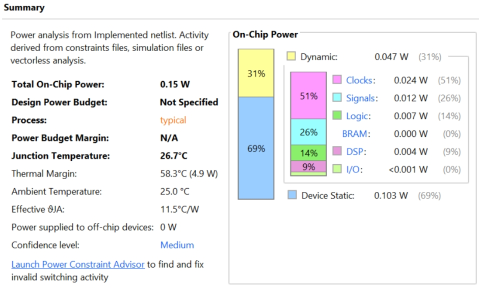

# FPGA MNIST Neural Network Inference

**Target:** Xilinx Zynq-7020 (XC7Z020CLG400-1) &nbsp;|&nbsp; **Arithmetic:** Q16.16 fixed-point &nbsp;|&nbsp; **Language:** SystemVerilog &nbsp;|&nbsp; **Training:** PyTorch 2.x

---

## Overview

This project implements a complete **FPGA inference pipeline** for MNIST handwritten digit classification. The system evolves through five progressively refined hardware implementations — from a full-precision 2D CNN baseline to a ternary-quantised, activation-pruned model — all verified end-to-end in Vivado XSim and synthesised on a physical Zynq-7020.

The design philosophy: every architectural decision is driven by the hard resource constraints of the target chip (220 DSPs, 53,200 LUTs, 106,400 FFs, 140 BRAMs).

---

## Repository Structure

```
FPGA_NN-main/
│
├── README.md
├── LICENSE
│
├── cnn2d_baseline/                   ← Baseline 2D CNN (full-precision, two variants)
│   ├── hardware_sequential/          ← Sequential-filter: 1 DSP, 83K cycles
│   │   ├── conv_pool_2d.sv           ←   Conv+Pool FSM (serial filter loop)
│   │   ├── layer_seq.sv              ←   FC layer (BRAM weight ROM)
│   │   ├── cnn2d_top.sv
│   │   ├── cnn2d_synth_top.sv
│   │   └── tb_cnn2d.sv
│   └── hardware_parallel/            ← Parallel-filter: 67 DSPs, 28K cycles
│       ├── conv_pool_2d.sv           ←   Conv+Pool FSM (OUT_CH parallel DSPs)
│       ├── layer_seq.sv
│       ├── cnn2d_top.sv
│       ├── cnn2d_synth_top.sv
│       └── tb_cnn2d.sv
│
├── verilog_files/                    ← Active working files (currently sequential)
│
├── cnn_2d_new/                       ← TTQ+BN quantised model
│   ├── hardware_ttq/                 ←   TTQ+BN RTL (synthesised, timing-clean)
│   └── weights/                      ←   Ternary codes + Wp/Wn .mem files
│
├── cnn_act_prune/                    ← Activation pruning
│   ├── hardware/                     ←   TTQ+BN + Threshold pruning RTL
│   └── hardware_with_hysteresis/     ←   TTQ+BN + Hysteresis + Threshold RTL
│
├── python_files/                     ← Baseline training & weight export
├── cnn2d_weights/                    ← Baseline weight .mem files
├── constraints/                      ← Timing .xdc files
├── images/                           ← Vivado screenshots (1D CNN, 2D CNN)
└── bram_vs_lutram/                   ← BRAM vs LUTRAM comparison study
```

---

## Architecture Evolution

| Stage | Model | Folder | DSPs | Accuracy | HW Verified |
|:---:|---|---|:---:|:---:|:---:|
| 1 | MLP (784→10→10) | `verilog_files/` | 20 | 89.08% | ✅ |
| 2 | 1D CNN (k=5, 4→8ch) + FC | `verilog_files/` | 54 | ~94% | ✅ |
| **3a** | **2D CNN Baseline (sequential)** | **`cnn2d_baseline/hardware_sequential/`** | **23** | **98.35%** | ✅ |
| **3b** | **2D CNN Baseline (parallel)** | **`cnn2d_baseline/hardware_parallel/`** | **67** | **98.35%** | ✅ |
| **4a** | **TTQ+BN** | **`cnn_2d_new/hardware_ttq/`** | **51** | **97.28%** | ✅ |
| **4b-T** | **TTQ+BN + Threshold** | **`cnn_act_prune/hardware/`** | **54** | **97.25%** | ✅ |
| **4b-H** | **TTQ+BN + Hysteresis** | **`cnn_act_prune/hardware_with_hysteresis/`** | **54** | **96.96%** | ✅ |

---

## Design Style — Common Architecture

All five hardware models share the same structural foundation, ensuring the comparison isolates the effect of quantisation and pruning rather than architectural differences.

| Design Aspect | Baseline (Seq.) | Baseline (Par.) | TTQ+BN | TTQ+Threshold | TTQ+Hysteresis |
|---|---|---|---|---|---|
| **Pipeline style** | 1-stage | 1-stage | 1-stage | 1-stage | 1-stage |
| **Conv filter proc.** | Sequential | Parallel | Sequential | Sequential | Sequential |
| **Per-tap operation** | 32×32 multiply | 32×32 multiply | Ternary add/sub | Ternary add/sub | Ternary add/sub |
| **Post-tap stages** | Store | Store (×OUT_CH) | Scale+BN+Store | Scale+BN+Store | Scale+BN+Store |
| **FC processing** | Serial, BRAM ROM | Serial, BRAM ROM | Serial, BRAM ROM | Serial, BRAM ROM | Serial, BRAM ROM |
| **Weight format** | 32-bit Q16.16 | 32-bit Q16.16 | 2-bit ternary | 2-bit ternary | 2-bit ternary |
| **Fixed-point** | Q16.16 | Q16.16 | Q16.16 | Q16.16 | Q16.16 |
| **Target** | Zynq-7020 | Zynq-7020 | Zynq-7020 | Zynq-7020 | Zynq-7020 |
| **Clock** | 100 MHz | 100 MHz | 100 MHz | 100 MHz | 100 MHz |

**Key distinction:** The sequential baseline time-shares a single 32×32 multiplier across all filters and taps. The parallel baseline instantiates OUT_CH dedicated multipliers (4 for Conv1, 8 for Conv2) processing all filters simultaneously. TTQ replaces per-tap multiplies with ternary add/subtract (zero DSPs per tap) and adds dedicated Wp/Wn scaling and BN multiply stages once per output position.

---

## Hardware Comparison Table

> Target: Zynq-7020 @ 100 MHz &nbsp;|&nbsp; 🟢 = best in row &nbsp;|&nbsp; 🟡 = timing caution

### Software Accuracy

| Metric | Baseline (Seq.) | Baseline (Par.) | TTQ+BN | TTQ+Threshold | TTQ+Hysteresis |
|---|:---:|:---:|:---:|:---:|:---:|
| **Accuracy (%)** | **98.35** 🟢 | **98.35** 🟢 | 97.28 | 97.25 | 96.96 |
| Δ from baseline | — | — | −1.07% | −1.10% | −1.39% |
| Δ from TTQ+BN | — | — | — | −0.03% | −0.32% |

### Simulation — Latency & Throughput

| Metric | Baseline (Seq.) | Baseline (Par.) | TTQ+BN | TTQ+Threshold | TTQ+Hysteresis |
|---|:---:|:---:|:---:|:---:|:---:|
| **Total cycles** | 83,198 | 28,704 | 90,534 | 88,706 | 81,505 |
| **Latency @100MHz (ms)** | 0.832 | **0.287** 🟢 | 0.905 | 0.887 | 0.815 |
| **Throughput (inf/s)** | 1,202 | **3,484** 🟢 | 1,104 | 1,128 | 1,227 |
| Top logit (confidence) | 578,677 | 578,677 | 576,881 | 634,415 | 631,128 |
| Result | PASS | PASS | PASS | PASS | PASS |

### Synthesis — Timing

| Metric | Baseline (Seq.) | Baseline (Par.) | TTQ+BN | TTQ+Threshold | TTQ+Hysteresis |
|---|:---:|:---:|:---:|:---:|:---:|
| **Setup WNS (ns)** | 0.291 | 0.291 | **0.853** 🟢 | 0.039 🟡 | 0.289 |
| Hold WHS (ns) | 0.116 | **0.137** 🟢 | 0.043 | 0.116 | 0.116 |
| WPWS (ns) | 9.000 | 9.000 | 9.000 | 9.500 | **9.750** 🟢 |
| Failing endpoints | 0 | 0 | 0 | 0 | 0 |

### Synthesis — Power

| Metric | Baseline (Seq.) | Baseline (Par.) | TTQ+BN | TTQ+Threshold | TTQ+Hysteresis |
|---|:---:|:---:|:---:|:---:|:---:|
| **Total power (W)** | 0.161 | 0.191 | **0.153** 🟢 | 0.171 | 0.200 |
| Dynamic power (W) | 0.056 | 0.085 | **0.048** 🟢 | 0.065 | 0.094 |
| Dynamic fraction | 35% | 44% | **31%** 🟢 | 38% | 47% |
| Energy / inf (mJ) | 0.134 | **0.055** 🟢 | 0.138 | 0.152 | 0.163 |
| Junction temp (°C) | 26.9 | 27.2 | **26.8** 🟢 | 27.0 | 27.3 |

### Synthesis — Resource Utilisation

| Resource | Baseline (Seq.) | Baseline (Par.) | TTQ+BN | TTQ+Threshold | TTQ+Hysteresis |
|---|:---:|:---:|:---:|:---:|:---:|
| **LUT / 53,200** | 14,925 (28.1%) | 19,980 (37.6%) | **14,588 (27.4%)** 🟢 | 23,085 (43.4%) | 33,565 (63.1%) |
| **FF / 106,400** | 31,571 (29.7%) | 32,162 (30.2%) | **31,523 (29.6%)** 🟢 | 31,591 (29.7%) | 32,734 (30.8%) |
| **BRAM / 140** | 9 (6.4%) | 9 (6.4%) | **1 (0.7%)** 🟢 | **1 (0.7%)** 🟢 | **1 (0.7%)** 🟢 |
| **DSP / 220** | **23 (10.5%)** 🟢 | 67 (30.5%) | 51 (23.2%) | 54 (24.6%) | 54 (24.6%) |

---

## Metric-by-Metric Justification

### Accuracy
The baseline achieves 98.35% using full 32-bit weights with no quantisation error. TTQ+BN loses 1.07% by collapsing every weight to `{+Wp, 0, −Wn}`. Learnable Wp/Wn scalars and folded BN partially recover accuracy, making TTQ the most efficient accuracy–compression trade-off. Threshold pruning adds only −0.03% because it targets post-ReLU layers where small activations act as noise. Hysteresis pruning costs −0.32% more because the spatial mask occasionally removes thin-stroke features in MNIST digits.

### Latency & Throughput
The sequential baseline (83K cycles) processes one filter at a time: each position costs TAP_COUNT + 3 cycles. The parallel baseline (28,704 cycles) computes all OUT_CH filters simultaneously, spending TAP_COUNT + 2 + OUT_CH cycles per position — 3.2× faster. TTQ is slowest (90,534 cycles) despite ternary computation because the added S_CONV_SCALE and S_CONV_BN states add 2 extra cycles per position. Threshold pruning skips taps where `|act| < τ`, saving ~2% of TTQ's cycles; hysteresis mask pre-zeros spatial regions, saving ~10%.

### DSPs
**Sequential baseline (23 DSPs):** One shared 32×32 multiplier per module, time-shared across all taps and filters. Vivado maps this to ~4-6 DSP48E1 per module × 4 modules.
**Parallel baseline (67 DSPs):** OUT_CH dedicated multipliers per conv module (4 for Conv1, 8 for Conv2). Each 32×32 multiply maps to ~4-5 DSP48E1 slices. This is the natural cost of full-precision parallel computation.
**TTQ (51 DSPs):** Zero DSPs per tap (ternary = add/subtract). Pays 3 dedicated multipliers per module for Wp/Wn scaling and BN — fired once per output position, not per tap. The parallel baseline (67) vs TTQ (51) correctly shows full-precision costs more DSPs than ternary.
**Threshold/Hysteresis (+3 DSPs):** Lookahead address arithmetic adds constant-multiply chains that Vivado maps to DSPs.

### LUTs
**Sequential (14,925):** Single weight MUX tree per module. Similar to TTQ's LUT count.
**Parallel (19,980):** OUT_CH simultaneous weight MUX reads require OUT_CH parallel MUX trees on 32-bit arrays — significantly more LUTs. Large conv_buf decode logic (all filters) also adds overhead.
**TTQ (14,588):** 2-bit ternary code MUXes are 16× narrower than 32-bit weight MUXes. The LUT savings from weight compression outweigh the extra BN/scaling control logic.
**Threshold (23,085):** Per-filter threshold comparators, precomp_below registers, and 2-tap lookahead address logic add ~8,500 LUTs.
**Hysteresis (33,565):** The `act_mask_gen` module's 2-pass spatial filter with distributed RAM, cardinal-neighbour comparators, and per-channel state tracking dominates at 63.1% LUT utilisation.

### FFs
All designs stay within a narrow 29.6–30.8% band because FFs are dominated by pipeline registers, FSM state, and counters — structurally identical across all models. Small variations reflect extra registered stages (BN params, mask state, threshold registers).

### BRAM
**Both baselines (9 BRAM):** FC1 (7,680 × 32b) and FC2 (720 × 32b) weights stored in `layer_seq`'s internal `w_rom` via `(* ram_style = "block" *)`. Parallel baseline additionally stores the all-filter conv_buf (86K+31K bits) in BRAM.
**TTQ/pruned (1 BRAM):** FC ternary codes are 2-bit (7,680 × 2b = 15,360b) — fits in <1 BRAM36. Conv_buf is single-filter (small enough for distributed RAM). The 9× BRAM difference directly reflects 32-bit vs 2-bit weight storage cost.

### Power
Static device leakage (~0.106W) is identical across all designs, dominating total power and compressing apparent differences. Dynamic power differences are genuine: the parallel baseline's 67 DSPs toggling every cycle cost 0.085W dynamic vs. sequential's 0.056W. TTQ's fewer DSPs and ternary accumulation reduce dynamic power to 0.048W. Hysteresis has highest dynamic power (0.094W) from the mask generator's two-pass spatial filtering logic. Despite higher instantaneous power, the parallel baseline achieves the lowest energy per inference (0.055 mJ) by completing 3.2× faster.

### Timing
All designs meet 100 MHz with no failing endpoints. TTQ has the best setup margin (0.853 ns) because ternary add/subtract has a shorter combinational path than 32×32 multiply + accumulate, and S_CONV_SCALE/BN states break long paths into registered stages. Both baselines share WNS = 0.291 ns — the critical path runs through the combinational 32×32 multiply chain. Threshold pruning has the tightest margin (0.039 ns) due to the threshold comparator adding to the critical path.

---

## Stage 3 — 2D CNN Baseline

### Architecture

```
Input (28×28×1)
    ▼  Conv2D (3×3, 4 filters) + ReLU       → 26×26×4
    ▼  MaxPool2D (2×2)                       → 13×13×4
    ▼  Conv2D (3×3, 8 filters) + ReLU       → 11×11×8
    ▼  MaxPool2D (2×2)                       → 5×5×8
    ▼  Flatten                               → 200
    ▼  FC (200→32) + ReLU
    ▼  FC (32→10)
    ▼  argmax → predicted digit
```

**Total parameters:** 7,044 weights + 54 biases = 7,098 &nbsp;|&nbsp; **Test accuracy:** 98.35%

### 3a — Sequential-Filter (`cnn2d_baseline/hardware_sequential/`)

One filter processed at a time. Single 32×32 multiplier per conv module. Conv buffer stores only one filter's activations (CONV_POSITIONS × 32b).

| Layer | Cycles | Reason |
|---|:---:|---|
| Conv1 + Pool1 | 35,830 | 4 filters × (676×12 + 169×5) |
| Conv2 + Pool2 | 38,754 | 8 filters × (121×39 + 25×5) |
| FC1 | 7,778 | 32 neurons × (239+4) |
| FC2 | 836 | 10 neurons × (71+4) |
| **Total** | **83,198** | |

### 3b — Parallel-Filter (`cnn2d_baseline/hardware_parallel/`)

All output filters computed simultaneously. OUT_CH dedicated 32×32 multipliers per conv module. Conv buffer stores all filters in BRAM.

| Layer | Cycles | Reason |
|---|:---:|---|
| Conv1 + Pool1 | 13,520 | 676×(9+2+4) + 4×169×5 |
| Conv2 + Pool2 | 6,566 | 121×(36+2+8) + 8×25×5 |
| FC1 | 7,778 | Same — FC is always serial |
| FC2 | 840 | Same |
| **Total** | **28,704** | |

---

## Stage 4a — TTQ+BN (`cnn_2d_new/hardware_ttq/`)

### Why TTQ?

Full-precision weights cost one 32×32 DSP multiply **per tap**. TTQ replaces each weight with `{+Wp, 0, −Wn}` — a 2-bit code. Positive taps add the input; negative taps subtract; zero taps skip. No DSP needed per tap.

| Metric | Baseline | TTQ+BN | Saving |
|---|:---:|:---:|:---:|
| Weight bits | 32 | 2 | 16× compression |
| DSPs (conv) | 67 (parallel) / 23 (seq.) | 51 | −24% vs parallel |
| Accuracy | 98.35% | 97.28% | −1.07% |

### TTQ Weight Statistics

| Layer | Shape | Wp | Wn | Sparsity |
|---|---|:---:|:---:|:---:|
| conv1 | (4,1,3,3) | 0.15519 | 0.16134 | 2.8% |
| conv2 | (8,4,3,3) | 0.10350 | 0.10207 | 3.8% |
| fc1 | (32,200) | 0.06843 | 0.06875 | 6.0% |
| fc2 | (10,32) | 0.62382 | 0.60108 | 4.4% |

### Vivado Results

| | |
|---|---|
|  |  |
|  | |

---

## Stage 4b — Activation Pruning

The TTQ+BN model generates sparse post-ReLU activations (24–51% zeros). The FSM still consumes one cycle per zero-activation tap. Activation pruning exploits this sparsity to skip unproductive taps.

### Method 1 — Threshold Pruning (`cnn_act_prune/hardware/`)

Per-filter threshold `τ_f`. If `|activation| < τ_f`, the tap is skipped. τ=0.30 applied to Conv2 and FC1 (post-ReLU layers).

### Method 2 — Hysteresis Spatial Mask (`cnn_act_prune/hardware_with_hysteresis/`)

2-pass spatial filter classifying activations as ACTIVE / UNCERTAIN / INACTIVE. Uncertain activations are resolved by checking 4 cardinal neighbours.

### Vivado Results — Threshold Pruning

| | |
|---|---|
|  |  |
|  |  |

### Vivado Results — Hysteresis + Threshold

| | |
|---|---|
|  |  |
|  |  |

---

## Q16.16 Fixed-Point Format

```
Bit 31                Bit 16  Bit 15                Bit 0
  S  IIIIIIIIIIIIIIII  .  FFFFFFFFFFFFFFFF
 sign  integer (16b)         fractional (16b)

Range:      −32768.0  to  +32767.99998
Resolution: 1/65536  ≈  0.0000153
Multiply:   64-bit product  >>>  16  →  back to Q16.16
```

---

## Running Hardware Simulation (Vivado)

### Baseline Sequential
1. Add sources: `cnn2d_baseline/hardware_sequential/*.sv`
2. Set simulation dir to `cnn2d_weights/`
3. Top module: `tb_cnn2d` → expect `DETECTED DIGIT: 9`, `RESULT: PASS`

### Baseline Parallel
1. Add sources: `cnn2d_baseline/hardware_parallel/*.sv`
2. Set simulation dir to `cnn2d_weights/`
3. Top module: `tb_cnn2d`

### TTQ+BN
1. Add sources: `cnn_2d_new/hardware_ttq/*.sv`
2. Set simulation dir to `cnn_2d_new/weights/`
3. Top module: `tb_cnn2d_ttq`

### Threshold Pruned
1. Add sources: `cnn_act_prune/hardware/*.sv`
2. Set simulation dir to `cnn_act_prune/weights/`
3. Top module: `tb_cnn2d_pruned`

### Hysteresis + Threshold
1. Add sources: `cnn_act_prune/hardware_with_hysteresis/*.sv`
2. Set simulation dir to `cnn_act_prune/weights/`
3. Top module: `tb_cnn2d_pruned`

---

## Key References

1. Zhu, C. et al. "Trained Ternary Quantization." ICLR 2017.
2. Canny, J. "A Computational Approach to Edge Detection." IEEE TPAMI 1986.
3. Zynq-7020 Product Specification, AMD/Xilinx UG585.
4. Li, F. & Liu, B. "Ternary Weight Networks." arXiv 2016.
