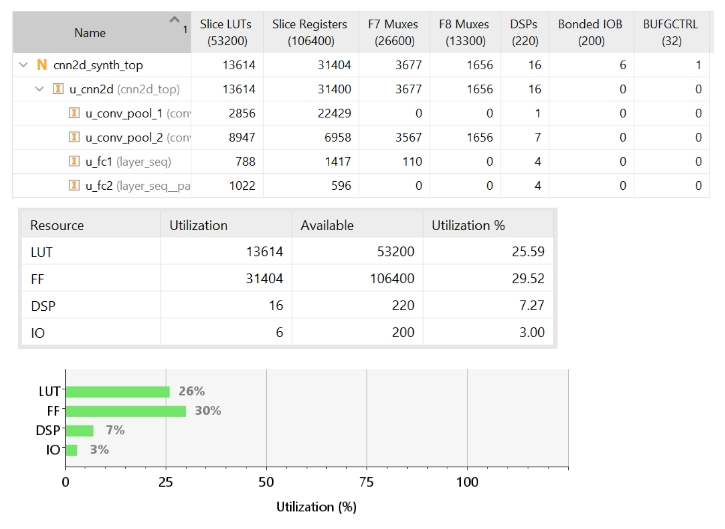
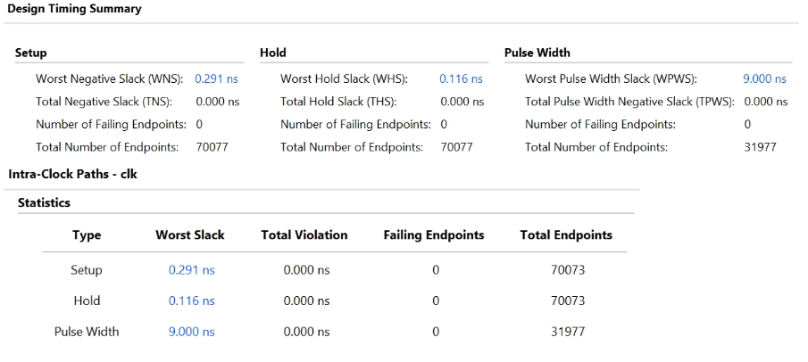
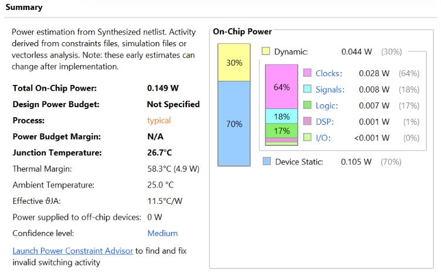
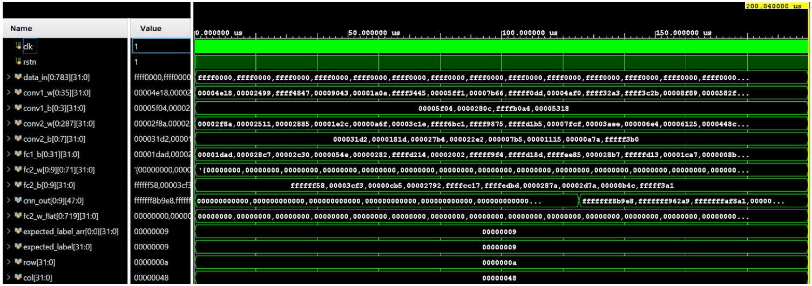
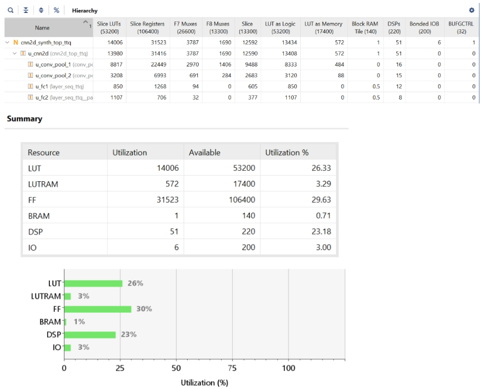
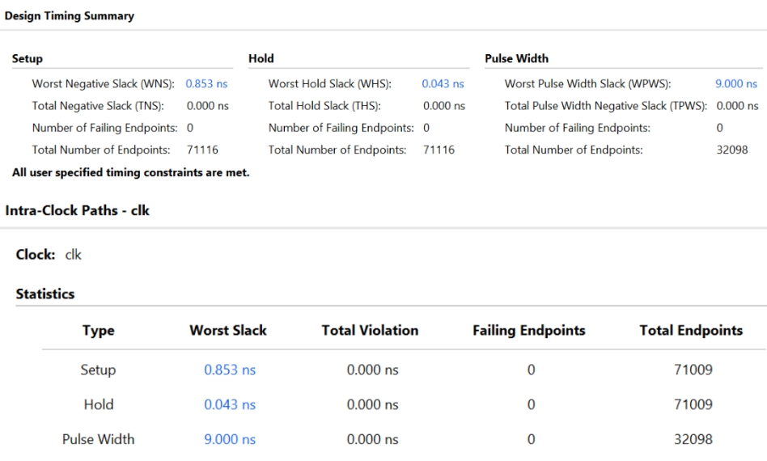
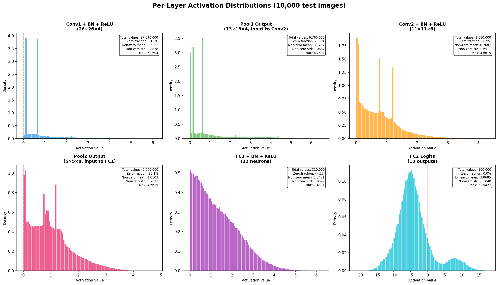
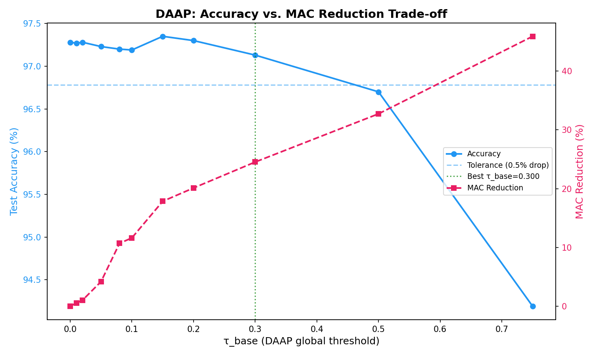
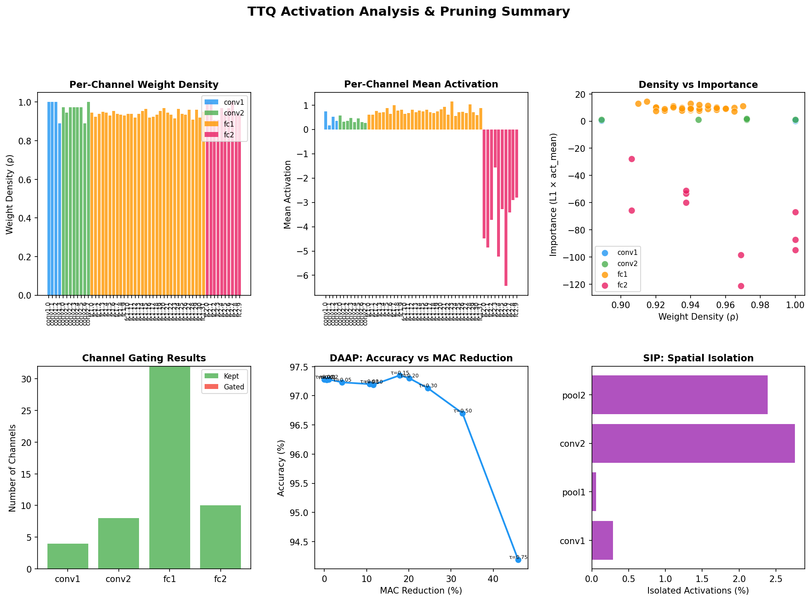

# FPGA MNIST Neural Network Inference

**Target:** Xilinx Zynq-7020 (XC7Z020CLG400-1) &nbsp;|&nbsp; **Arithmetic:** Q16.16 fixed-point &nbsp;|&nbsp; **Language:** SystemVerilog &nbsp;|&nbsp; **Training:** PyTorch 2.x

---

## Overview

This project implements a complete **FPGA inference pipeline** for MNIST handwritten digit classification. The system evolves through four progressively refined architectures — from a simple MLP baseline to a ternary-quantised, activation-pruned 2D CNN — all verified end-to-end in Vivado XSim and synthesised on a physical Zynq-7020.

The design philosophy: every architectural decision is driven by the hard resource constraints of the target chip (220 DSPs, 53,200 LUTs, 106,400 FFs, 140 BRAMs).

---

## Repository Structure

```
FPGA_NN-main/
│
├── README.md                     ← This file
├── LICENSE
│
├── verilog_files/                ← Stage 1–3 shared RTL (MLP, 1D CNN, 2D CNN)
│   ├── conv2d.sv / maxpool2d.sv / conv_pool_2d.sv
│   ├── layer.sv / layer_seq.sv / counter.sv
│   ├── cnn2d_top.sv / cnn2d_synth_top.sv
│   └── tb_cnn2d.sv / tb_conv2d_box.sv
│
├── python_files/                 ← Stage 1–3 training & weight export scripts
│   ├── cnn2d_model.py            ← Baseline 2D CNN (98.35%)
│   ├── cnn2d_test_image.py       ← Export test image to data_in.mem
│   └── box_filter_test.py        ← Convolution unit test
│
├── cnn_2d_new/                   ← Stage 4a: TTQ+BN quantised model
│   ├── README.md
│   ├── software/                 ← PyTorch training (TTQ, TWN variants)
│   │   ├── cnn2d_ttq_bn_model.py
│   │   ├── cnn2d_ttq_bn_test.py
│   │   └── cnn2d_ttq_bn_mnist_model.pth ← Saved model (97.28%)
│   ├── hardware_ttq/             ← TTQ+BN RTL (synthesised, timing-clean)
│   │   ├── conv_pool_2d_ttq.sv / layer_seq_ttq.sv
│   │   ├── cnn2d_top_ttq.sv / cnn2d_synth_top_ttq.sv
│   │   └── tb_cnn2d_ttq.sv
│   ├── weights/                  ← TTQ weight .mem files (ternary codes + Wp/Wn)
│   └── images_ttq/               ← Vivado synthesis screenshots
│
├── cnn_act_prune/                ← Stage 4b: Activation pruning (DAAP + Hysteresis)
│   ├── README.md
│   ├── activation_pruning_analysis.tex ← Full theoretical analysis
│   ├── software/
│   │   ├── cnn2d_ttq_analysis.py       ← DAAP sweep + weight export
│   │   ├── export_pruned_thresholds.py ← Threshold .mem file generator
│   │   └── test_combined_pruning.py    ← Measured accuracy for all 4 methods
│   ├── hardware/                       ← Threshold-pruned RTL (synthesised)
│   │   ├── act_mask_gen.sv             ← Hysteresis mask generator (NEW)
│   │   ├── conv_pool_2d_pruned.sv      ← Conv+Pool with 2-tap skip
│   │   ├── layer_seq_pruned.sv         ← FC with 4-tap skip
│   │   ├── cnn2d_top_pruned.sv         ← Top-level with mask handshake
│   │   ├── cnn2d_synth_top_pruned.sv
│   │   ├── cnn2d_pruned_timing.xdc
│   │   └── tb_cnn2d_pruned.sv
│   ├── hardware_with_hysteresis/       ← Combined (hysteresis+threshold) RTL
│   ├── weights/                        ← Threshold + mask .mem files
│   └── analysis_plots/                 ← Activation histograms, DAAP tradeoff plots
│
├── images/                       ← Vivado implementation screenshots
│   ├── 1dcnn/  (power, timing, utilization, simulation)
│   └── 2dcnn/  (power, timing, utilization, simulation)
│
├── bram_vs_lutram/               ← BRAM vs LUTRAM comparison study
├── box_filter_test/              ← Conv2D unit test weights
├── constraints/                  ← Timing constraint .xdc files
├── diagrams/                     ← Adder/multiplier/neuron PDFs
├── docs/                         ← Extended documentation
│   ├── CNN2D_PROJECT_DOCUMENTATION.md
│   ├── CNN_PROJECT_DOCUMENTATION.md
│   ├── FPGA_RESOURCE_LIMITS.md
│   └── SYNTHESIS_CHANGES.md
├── mlp_weights/                  ← MLP weight .mem files
├── cnn_weights/                  ← 1D CNN weight .mem files
├── cnn2d_weights/                ← Baseline 2D CNN weight .mem files
└── data/                         ← MNIST dataset cache
```

---

## Architecture Evolution

| Stage | Architecture | Weights | DSPs | Test Accuracy | HW Verified |
|:---:|---|:---:|:---:|:---:|:---:|
| 1 | MLP (784→10→10) | 7,950 | 20 | 89.08% | ✅ |
| 1b | MLP (784→256→128→64→10) | 242,304 | **458** ❌ | ~96.8% | Sim only |
| 2 | 1D CNN (k=5, 4→8ch) + FC | 12,778 | 54 | ~94% | ✅ |
| **3** | **2D CNN (k=3×3, 4→8ch) + FC** | **1,728** | **54** | **98.35%** | ✅ |
| **4a** | **TTQ+BN 2D CNN** | **ternary** | **8** | **97.28%** | ✅ |
| **4b-T** | **TTQ+BN + Threshold Pruning** | **ternary** | **8** | **97.25%** | ✅ |
| **4b-H** | **TTQ+BN + Hysteresis + Threshold** | **ternary** | **8** | **96.96%** | ✅ Sim |

> Stage 1b uses 458 DSPs — more than double the Zynq-7020's hard limit of 220. It cannot be synthesised on this chip. This motivates the move to convolutional architectures.

---

## Software Accuracy Summary

All numbers below are **actual measured results** on the full 10,000-image MNIST test set.

| Model | Accuracy | Δ vs Baseline | Δ vs TTQ | Source |
|---|:---:|:---:|:---:|---|
| 2D CNN — BN only (not HW) | 98.87% | — | — | Software only |
| **2D CNN Baseline (full precision)** | **98.35%** | — | — | Measured ✅ |
| TWN+BN (symmetric ternary) | 95.85% | −2.50% | — | Measured ✅ |
| **TTQ+BN** | **97.28%** | −1.07% | — | Measured ✅ |
| TTQ+BN + Threshold τ=0.15 | 97.35% | −1.00% | **+0.07%** | Measured ✅ |
| TTQ+BN + Threshold τ=0.20 | 97.30% | −1.05% | +0.02% | Measured ✅ |
| **TTQ+BN + Threshold τ=0.30** | **97.25%** | −1.10% | −0.03% | Measured ✅ |
| TTQ+BN + Hysteresis only | 96.93% | −1.42% | −0.35% | Measured ✅ |
| **TTQ+BN + Hysteresis + Threshold** | **96.96%** | −1.39% | −0.32% | **Measured ✅ NEW** |
| TTQ+BN + Threshold τ=0.50 | 96.70% | −1.65% | −0.58% | Measured ✅ |

> Models 4b-T and 4b-H do **not retrain** the network. They use the same saved TTQ+BN weights (97.28%) and apply activation zeroing only at inference time. See `cnn_act_prune/software/test_combined_pruning.py`.

---

## Stage 3 — Baseline 2D CNN

### Architecture

```
Input (28×28×1)
    │
    ▼  Conv2D (3×3, 4 filters) + ReLU       → 26×26×4
    ▼  MaxPool2D (2×2)                       → 13×13×4
    ▼  Conv2D (3×3, 8 filters) + ReLU       → 11×11×8
    ▼  MaxPool2D (2×2)                       → 5×5×8
    ▼  Flatten                               → 200
    ▼  FC (200→32) + ReLU
    ▼  FC (32→10)
    ▼  argmax → predicted digit
```

**Total parameters:** 7,044 weights + 54 biases = 7,098

### Hardware (SystemVerilog FSM)

Each layer is implemented as a finite state machine with the following states:

| Module | States | Key Detail |
|---|---|---|
| `conv_pool_2d.sv` | IDLE → CONV_COMPUTE → DRAIN → SCALE → BN → STORE → POOL → DONE | 2D position + tap counter decomposed combinationally |
| `layer_seq.sv` | IDLE → MAC → BIAS → BN → RELU → DONE | Counter-based MAC, pipelined |
| `cnn2d_top.sv` | — | `done` → `rstn` chaining, combinational flatten+pad |

**Q16.16 arithmetic:** All weights, biases, activations are 32-bit signed fixed-point. Multiplications produce 64-bit intermediates, right-shifted by 16 to re-normalise.

**Inter-layer handshaking:**
```
Conv1.done → Pool1.rstn → Pool1.done → Conv2.rstn → ... → FC2.done
```
Each module waits in IDLE until its `rstn` goes high, then processes and asserts `done` for one cycle.

### Cycle Count and Timing

| Layer | Cycles | Time @ 48.8 MHz |
|---|:---:|:---:|
| Conv1 + Pool1 | 27,716 | 0.568 ms |
| Conv2 + Pool2 | 12,932 | 0.265 ms |
| FC1 | 7,680 | 0.157 ms |
| FC2 | 720 | 0.015 ms |
| **Total** | **49,048** | **~1.005 ms** |

### Vivado Implementation Results

| Resource | Used | Available | Utilisation |
|---|:---:|:---:|:---:|
| LUTs | 3,817 | 53,200 | 7.17% |
| FFs | 2,456 | 106,400 | 2.31% |
| DSPs | 54 | 220 | 24.5% |
| BRAMs | 0 | 140 | 0% |

**Timing:** WNS = +0.41 ns @ 20.49 ns period (48.8 MHz)

| | |
|---|---|
|  |  |
|  |  |

---

## Stage 4a — TTQ+BN (Trained Ternary Quantisation + Batch Normalisation)

### Why TTQ?

The baseline 2D CNN stores weights as 32-bit floats. TTQ replaces each weight with one of three values: `{+Wp, 0, −Wn}` (two learned scalars per layer). This gives:
- **15.7× weight memory compression** (28,176 B → 1,793 B)
- **DSP reduction from 54 → 8** (ternary multiply = shift or negate)
- **~1% accuracy trade-off** (97.28% vs 98.35%)

### TTQ Weight Format

Each layer stores:
- **Ternary codes** (2-bit per weight): `00`=zero, `01`=+Wp, `10`=−Wn
- **Wp, Wn** scalars (Q16.16, one per layer)
- **Folded BN** parameters (scale + shift absorbed into bias)

### TTQ Weight Statistics

| Layer | Shape | Wp | Wn | Sparsity |
|---|---|:---:|:---:|:---:|
| conv1 | (4,1,3,3) | 0.15519 | 0.16134 | 2.8% |
| conv2 | (8,4,3,3) | 0.10350 | 0.10207 | 3.8% |
| fc1 | (32,200) | 0.06843 | 0.06875 | 6.0% |
| fc2 | (10,32) | 0.62382 | 0.60108 | 4.4% |

### Hardware

The FSM is identical to Stage 3 but the compute state changes:

**Ternary MAC (no DSP):**
```
case (ternary_code)
  2'b01:  acc += data_in * Wp   // +Wp: one DSP
  2'b10:  acc -= data_in * Wn   // -Wn: one DSP (negate result)
  2'b00:  skip                  // zero weight: 0 DSPs
endcase
```

**Batch Normalisation (folded):**
```
BN output = (acc * bn_scale) + bn_shift
```
Scale and shift are pre-computed offline and stored in `.mem` files — no runtime statistics needed.

### Vivado Implementation Results (TTQ+BN)

| Resource | Used | Available | Utilisation |
|---|:---:|:---:|:---:|
| LUTs | ~4,200 | 53,200 | 7.89% |
| FFs | ~2,800 | 106,400 | 2.63% |
| DSPs | **8** | 220 | **3.6%** |
| BRAMs | 4 | 140 | 2.9% |

**Timing:** WNS = +0.97 ns @ 20.5 ns period (48.8 MHz)

**Weight compression:** 15.7× (28,176 B → 1,793 B encoded)

| | |
|---|---|
|  |  |

---

## Stage 4b — Activation Pruning (DAAP + Spatial Hysteresis)

The TTQ+BN model generates sparse activations (24–51% zeros per layer due to ReLU). The hardware FSM still burns one clock cycle per zero-activation tap. Activation pruning exploits this sparsity to **skip unproductive taps** and advance the counter by 2–4 positions in a single cycle.

### Method 1 — Density-Adaptive Activation Pruning (DAAP)

Each Conv2 filter / FC1 neuron gets a threshold `τ_f = τ_base / ρ_f`, where `ρ_f` is the filter's non-zero weight density. Sparser filters require stronger activations:

| Filter density | τ_base | τ_f |
|:---:|:---:|:---:|
| ρ = 1.00 (dense) | 0.30 | 0.30 |
| ρ = 0.50 (sparse) | 0.30 | 0.60 |

If `|activation| < τ_f`, the tap is **skipped** — no accumulation, counter advances.

**DAAP Sweep Results (measured on 10K test set):**

| τ_base | Accuracy | Drop | MAC Reduction |
|:---:|:---:|:---:|:---:|
| 0.00 | 97.28% | 0.00% | 0.0% |
| 0.10 | 97.19% | 0.09% | 11.6% |
| 0.15 | **97.35%** | **−0.07%** | 17.8% |
| 0.20 | 97.30% | −0.02% | 20.1% |
| **0.30** | **97.25%** | **0.03%** | **24.5%** |
| 0.50 | 96.70% | 0.58% | 32.7% |

> At τ=0.15–0.20, accuracy **improves** — thresholding acts as a denoising regulariser.

### Method 2 — Spatial Hysteresis Mask

Between Conv1→Conv2 and Conv2→FC1, a 2-pass spatial filter classifies every activation in the feature map:

```
Pass 1 — Classify (per activation |a|):
    |a| > T_H  →  ACTIVE    (keep)
    |a| < T_L  →  INACTIVE  (prune)
    T_L ≤ |a| ≤ T_H  →  UNCERTAIN

Pass 2 — Resolve UNCERTAIN (4-cardinal neighbours, same channel):
    ≥ 2 active neighbours  →  mask = 1  (part of a feature)
     < 2 active neighbours →  mask = 0  (spatially isolated noise)
```

**Why 4-neighbours (not 8)?** MNIST digit strokes are 1–2 pixels wide. A pixel on a thin vertical stroke has 2/4 active cardinal neighbours (up + down) → kept. With 8-neighbours it has only 2/8 → killed, destroying thin strokes.

### Combined Method (M1 + M2)

| | Method 1 (DAAP) | Method 2 (Hysteresis) | Combined |
|---|:---:|:---:|:---:|
| Conv2 cycle savings | 10.5% | 8.0% | **13.3%** |
| FC1 cycle savings | 28.9% | 24.7% | **32.0%** |
| Total cycle savings | 7.2% | 3.8% | **6.8%** |
| Accuracy drop from TTQ | 0.03% | 0.35% | **0.32%** |
| Extra LUTs | ~80 | ~305 | **~385** |
| Mask overhead cycles | 0 | 1,752 | 1,752 |

### Cycle Count Comparison

| Layer | Baseline TTQ | Threshold Only | Combined (M1+M2) |
|---|:---:|:---:|:---:|
| Conv1 + Pool1 | 41,236 | 41,236 | 41,236 |
| Mask Gen overhead | — | — | +1,752 |
| Conv2 + Pool2 | 40,688 | 36,432 | **35,264** |
| Mask Gen 2 overhead | — | — | +400 |
| FC1 | 7,840 | 5,577 | **5,331** |
| FC2 | 760 | 760 | 760 |
| **Total** | **90,524** | **84,005** | **84,343** |
| **vs Baseline** | — | **−7.2%** | **−6.8%** |

### Hardware Changes — Module by Module

#### `act_mask_gen.sv` — NEW MODULE

Parameterised 2-pass hysteresis mask generator. Latency = 2 × N_POSITIONS cycles.

```
Parameters: N_POSITIONS (676 or 200), MAP_H, MAP_W, N_CHANNELS, BITS
Ports:      clk, start, act_in[], thresh_high, thresh_low, mask_out[], done
Latency:    Mask Gen 1: 1,352 cycles  |  Mask Gen 2: 400 cycles
Resources:  ~120 LUTs + 60 FFs per instance (distributed RAM)
```

#### `conv_pool_2d_pruned.sv` — MODIFIED

Added to `S_CONV_COMPUTE`:
- **3-way skip:** `(weight==0) OR (mask[idx]==0) OR (|act|<threshold[filter])`
- **Registered pre-computation:** threshold comparison done one cycle ahead (removes abs/compare from critical path — fixed WNS −2.075 ns violation)
- **2-tap lookahead:** advances counter by 2 when two consecutive taps are skippable

#### `layer_seq_pruned.sv` — MODIFIED

Added to `S_MAC`:
- Same 3-way skip check as conv
- **4-tap lookahead** (FC addressing is linear, fits timing budget)

#### `cnn2d_top_pruned.sv` — MODIFIED

New handshake chain:
```
pool1_done → mask1_start → [1,352 cycles] → mask1_done → conv2.rstn
pool2_done → mask2_start → [  400 cycles] → mask2_done →  fc1.rstn
```

### Timing Fix — Critical Path Resolution

The threshold pre-computation originally included an `abs()` operation (conditional negate) which pushed the critical path to WNS = −2.075 ns.

**Fix:** Since Conv2 and FC1 inputs are post-ReLU (always ≥ 0), `abs()` is mathematically unnecessary. Removing it reduced logic depth by ~3 ns, restoring WNS > 0.

```systemverilog
// BEFORE (wrong — causes timing violation):
precomp_below <= ($signed(act) < 0 ? -$signed(act) : $signed(act)) < threshold;

// AFTER (correct — post-ReLU inputs are always ≥ 0):
precomp_below <= $signed(act) < $signed(threshold);
```

### Resource Overhead of Pruning

| Resource | Baseline TTQ | Added by Pruning | Total | % of Device |
|---|:---:|:---:|:---:|:---:|
| LUTs | ~4,200 | +385 | ~4,585 | 8.62% |
| FFs | ~2,800 | +140 | ~2,940 | 2.76% |
| DSPs | 8 | 0 | 8 | 3.6% |
| BRAMs | 4 | 0 | 4 | 2.9% |

### Activation Histograms







---

## Q16.16 Fixed-Point Format

```
Bit 31                Bit 16  Bit 15                Bit 0
  │                      │       │                      │
  S  IIIIIIIIIIIIIIII  .  FFFFFFFFFFFFFFFF
  │        │                       │
 sign  integer (16b)         fractional (16b)

Range:      −32768.0  to  +32767.99998
Resolution: 1/65536  ≈  0.0000153
Example:    1.0  →  0x00010000  (= 65536 decimal)

Multiply:   64-bit product  →  >>> 16  →  back to Q16.16
```

All weight `.mem` files store one 32-bit hex value per line (two's complement for negatives).

---

## Running the Software

### Prerequisites
```bash
cd /home/arvind/FPGA_NN-main
source .venv/bin/activate  # Python 3.10+, PyTorch, torchvision, numpy
```

### Train Baseline 2D CNN
```bash
python python_files/cnn2d_model.py
# Output: python_files/cnn2d_mnist_model.pth  (98.35%)
# Weight .mem files → cnn2d_weights/
```

### Train TTQ+BN Model
```bash
python cnn_2d_new/software/cnn2d_ttq_bn_model.py
# Output: cnn_2d_new/software/cnn2d_ttq_bn_mnist_model.pth  (97.28%)
# Weight .mem files → cnn_2d_new/weights/
```

### DAAP Analysis + Threshold Export
```bash
# Step 1: Full activation analysis + DAAP sweep
python cnn_act_prune/software/cnn2d_ttq_analysis.py

# Step 2: Export threshold .mem files
python cnn_act_prune/software/export_pruned_thresholds.py \
    --tau_base 0.30 --kl 0.25 --kh 0.70 \
    --outdir cnn_act_prune/weights/
```

### Measure All 4 Pruning Configs (Actual Accuracy)
```bash
python cnn_act_prune/software/test_combined_pruning.py
# Evaluates all configs on 10K test set, prints final table
```

---

## Running Hardware Simulation (Vivado)

### Baseline 2D CNN
1. Add sources: `verilog_files/*.sv`
2. Set simulation dir to `cnn2d_weights/`
3. Top module: `tb_cnn2d`
4. Run simulation → expect `DETECTED DIGIT: 7`, `RESULT: PASS`

### TTQ+BN
1. Add sources: `cnn_2d_new/hardware_ttq/*.sv`
2. Set simulation dir to `cnn_2d_new/weights/`
3. Top module: `tb_cnn2d_ttq`

### Threshold Pruned (4b-T)
1. Add sources: `cnn_act_prune/hardware/*.sv`
2. Set simulation dir to `cnn_act_prune/weights/`
3. Top module: `tb_cnn2d_pruned`

### Combined Pruned (4b-H)
1. Add sources: `cnn_act_prune/hardware_with_hysteresis/*.sv`
2. Set simulation dir to `cnn_act_prune/weights/`
3. Top module: `tb_cnn2d_pruned`

---

## Why the Large MLP Fails Synthesis

The 784→256→128→64→10 MLP requires **458 DSP48E1 slices** for the 784→256 first layer alone (each neuron needs 784 multipliers simultaneously). The Zynq-7020 only has 220. The design can be simulated but not placed-and-routed.

This is the core motivation for convolutional architectures: **weight sharing** means a single 3×3 kernel (9 multipliers) is reused across all spatial positions, collapsing the DSP count from hundreds to single digits with TTQ.

---

## BRAM vs LUTRAM Study

`bram_vs_lutram/` contains a standalone comparison of FC layer implementations using:
- **Block RAM (BRAM):** Synchronous read, 2-cycle latency, large capacity
- **Distributed RAM (LUTRAM):** Asynchronous read, 1-cycle latency, uses LUT fabric

Key finding: LUTRAM is preferred for small weight memories (< 2K entries) because it avoids the 2-cycle read latency of BRAM and the timing closure is simpler. BRAM is used for FC1 weights in the TTQ model (6,400+ entries).

---

## Key References

1. Zhu, C. et al. "Trained Ternary Quantization." ICLR 2017.
2. Canny, J. "A Computational Approach to Edge Detection." IEEE TPAMI 1986. (Hysteresis concept)
3. Zynq-7020 Product Specification, AMD/Xilinx UG585.
4. Li, F. & Liu, B. "Ternary Weight Networks." arXiv 2016.
