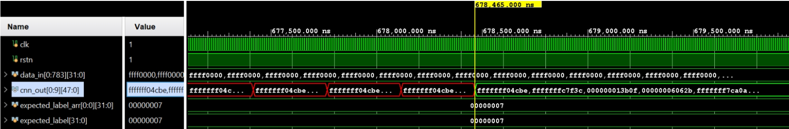
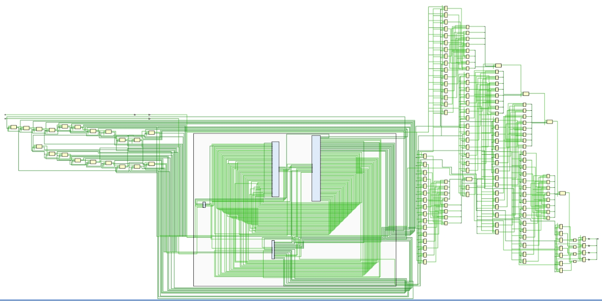
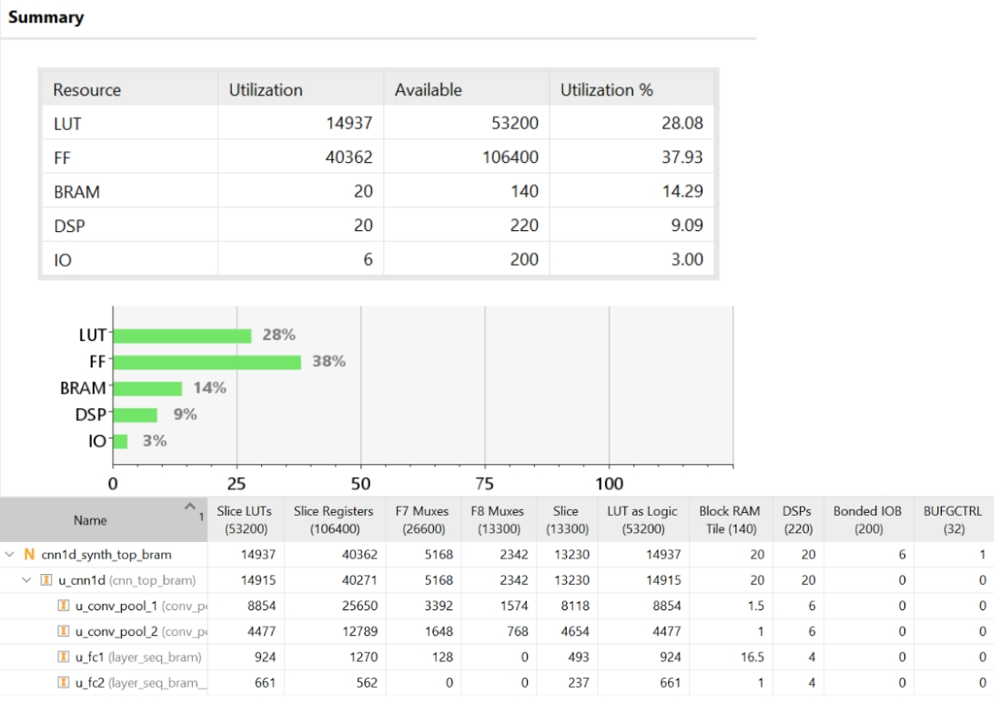
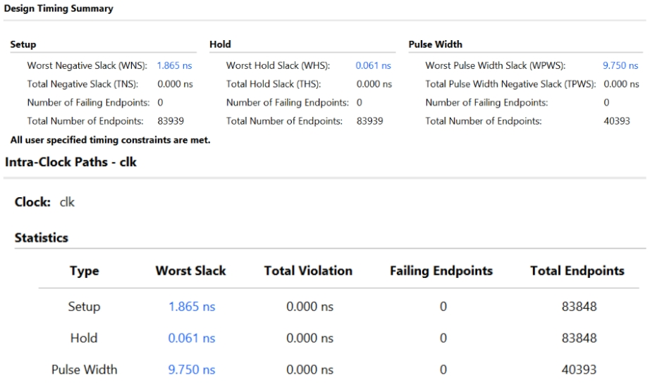
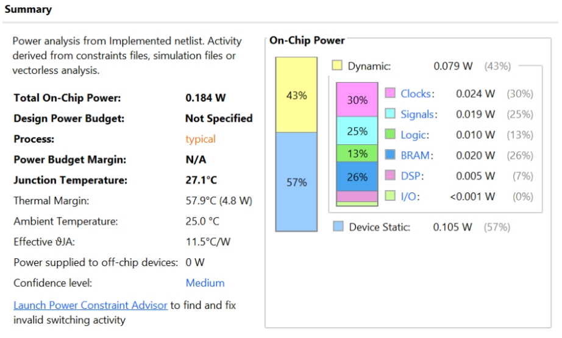
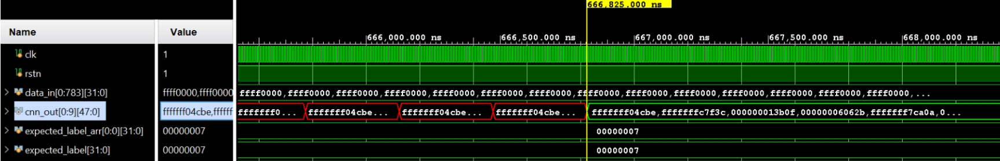
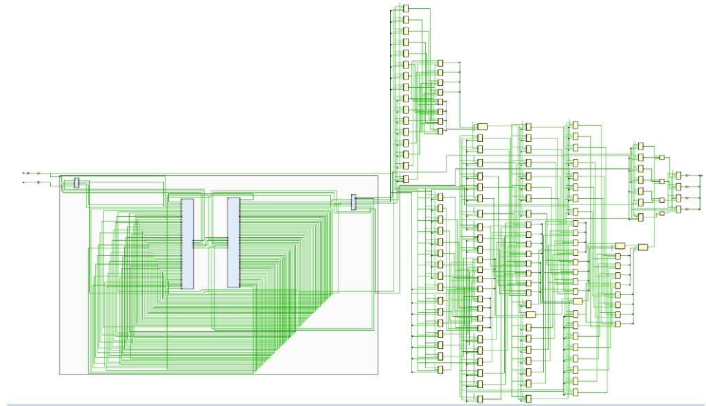
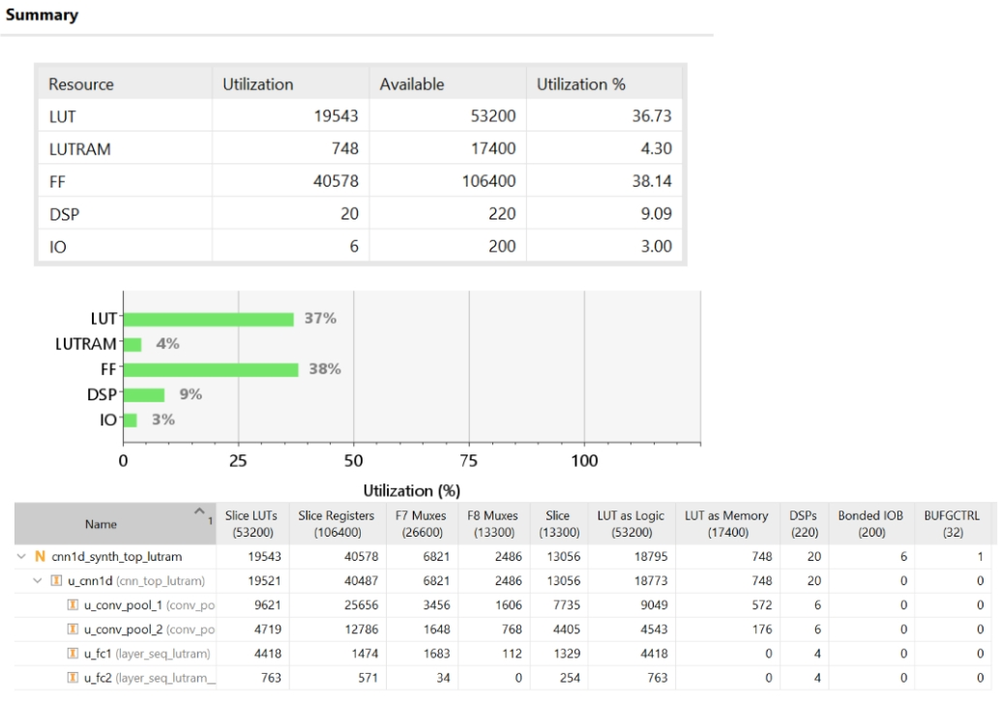
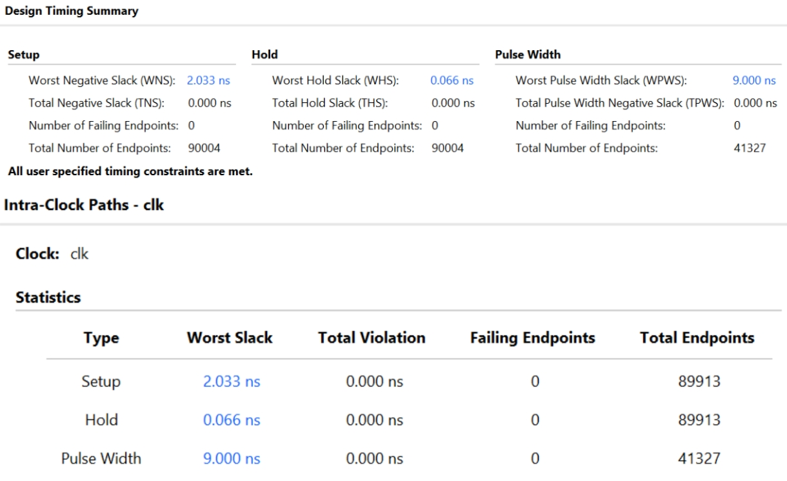
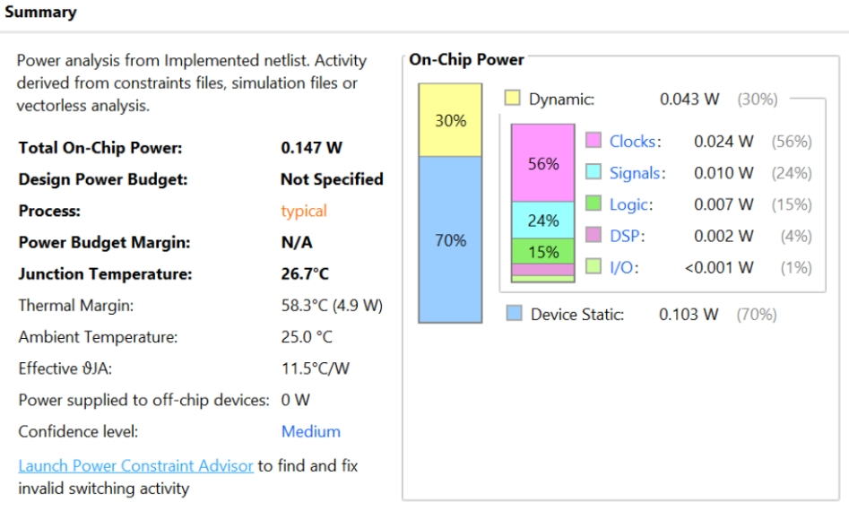

# Comprehensive Comparison: BRAM vs LUT RAM Implementations for 1D CNN

This document provides a detailed side-by-side comparison of two 1D CNN implementations on an FPGA (xc7z020) based on Vivado post-implementation and simulation reports. The two variants differ strictly in how they store weights, biases, and buffers: one utilizes dedicated Block RAM (BRAM), while the other utilizes Distributed RAM (LUT RAM).

| Variant     | Folder    | Memory Type                   | Xilinx Attribute                  |
| ----------- | --------- | ----------------------------- | --------------------------------- |
| **BRAM**    | `bram/`   | Block RAM (36Kbit SRAM tiles) | `(* ram_style = "block" *)`       |
| **LUT RAM** | `lutram/` | Distributed RAM (LUT-based)   | `(* ram_style = "distributed" *)` |

Both variants produce **identical inference results** (same CNN weights, same computation).

---

## Network Architecture (Identical for Both)

```
Input: 784 × 1 (MNIST 28×28 flattened, Q16.16 fixed-point)
  ↓
Conv1 (1→4, kernel=5) → ReLU → MaxPool(4)    → 195 × 4
  ↓
Conv2 (4→8, kernel=3) → ReLU → MaxPool(4)    → 48 × 8
  ↓
Flatten → 384
  ↓
FC1 (384→32) → ReLU
  ↓
FC2 (32→10) → logits → argmax → predicted digit
```

---

## 1. Extracted Data Comparison Table

The following table synthesizes the quantitative metrics extracted directly from the synthesized/implemented Vivado reports and XSim waveforms for both variants.

| Metric Category | Specific Metric | BRAM Variant | LUT RAM Variant | Difference / Winner |
| :--- | :--- | :--- | :--- | :--- |
| **Utilization (Resources)** | **LUT Used** | 14,937 (28.08%) | 19,543 (36.73%) | BRAM saves ~4,606 LUTs |
| | **LUTRAM Used** | N/A | 748 (4.30%) | - |
| | **Flip-Flops (FF) Used**| 40,362 (37.93%) | 40,578 (38.14%) | Comparable (~200 FF diff) |
| | **BRAM (36k/18k) Used**| 20 blocks (14.29%) | 0 blocks (0%) | LUT RAM uses 0 BRAM |
| | **DSP48 Used** | 20 (9.09%) | 20 (9.09%) | Tie (Identical MAC usage) |
| | **Bonded IOB** | 6 (3.00%) | 6 (3.00%) | Tie |
| **Power Analysis** | **Total On-Chip Power** | 0.184 W | 0.147 W | LUT RAM uses 37 mW less |
| | **Device Static Power** | 0.105 W (57%) | 0.103 W (70%) | Comparable |
| | **Total Dynamic Power** | 0.079 W (43%) | 0.043 W (30%) | LUT RAM uses 36 mW less |
| | *— BRAM Power* | 0.020 W (26% dyn) | 0.000 W (0% dyn) | LUT RAM eliminates BRAM power |
| | *— Clocks Power* | 0.024 W (30% dyn) | 0.024 W (56% dyn) | Tie |
| | *— Signals Power* | 0.019 W (25% dyn) | 0.010 W (24% dyn) | LUT RAM uses less signal power|
| | *— Logic Power* | 0.010 W (13% dyn) | 0.007 W (15% dyn) | LUT RAM uses less logic power |
| | *— DSP Power* | 0.005 W (7% dyn) | 0.002 W (4% dyn) | LUT RAM uses less DSP power |
| **Timing (50 MHz Clock)** | **Worst Negative Slack (WNS)** | 1.865 ns | 2.033 ns | LUT RAM has slightly better WNS |
| | **Worst Hold Slack (WHS)**| 0.061 ns | 0.066 ns | Comparable |
| | **Worst Pulse Width Slack**| 9.750 ns | 9.000 ns | BRAM has better WPWS |
| | **Timing Met?** | Yes | Yes | Tie |
| **Performance (Simulation)**| **Total Inference Time** | 678,465.000 ns | 666,825.000 ns | LUT RAM finishes 11.64 µs faster |
| | **Correct Digit Output** | 7 (Matched) | 7 (Matched) | Both functionally identical |

---

## 2. Detailed Analysis of Variations

### 2.1 Resource Utilization Trade-offs

The fundamental architectural difference between the two designs is entirely evident in the utilization reports.

- **BRAM Variant:** Uses **20 BRAM tiles** to store the CNN's parameters (weights, biases) and intermediate convolution buffers. Because dedicated silicon is handling the memory, the general logic fabric usage is kept relatively low at **14,937 LUTs**.
- **LUT RAM Variant:** Completely eliminates the use of Block RAM (**0 blocks**), shifting the entire memory burden to the FPGA's distributed logic fabric. Consequently, it requires **19,543 LUTs**—an increase of approximately 4,606 LUTs.
- **Conclusion:** This highlights a classic FPGA design trade-off. If a design is constrained by logic cells (LUTs), shifting memory to BRAM is highly effective. Conversely, if a design is BRAM-starved (e.g., needed for large FIFOs or video buffers elsewhere), distributed LUT RAM provides a viable fallback, provided there is sufficient logic fabric available.

### 2.2 Power Consumption Anomalies

Prior expectations often suggest that distributing memory across thousands of logic cells (LUT RAM) increases dynamic power due to higher toggle rates and routing capacitance. However, the extracted Vivado power reports show the opposite for this specific implementation:

- The **Total Dynamic Power** for the BRAM version is significantly higher (0.079 W) compared to the LUT RAM version (0.043 W).
- The primary culprit is the BRAM itself, which consumes **0.020 W** just for memory operations.
- Furthermore, the **Signals Power** is higher in the BRAM version (0.019 W vs 0.010 W), likely due to the longer routing required to physically connect the logic fabric to the hard BRAM blocks located in specific columns on the FPGA die. The LUT RAM integrates memory directly adjacent to the logic querying it, potentially shortening signal paths and reducing capacitance in this specific low-frequency (50 MHz) design.

### 2.3 Timing and Clock Closure

Both designs easily met the 50 MHz (20.0 ns period) timing constraint.

- The **LUT RAM** implementation achieved a slightly better Setup Slack (WNS of **2.033 ns** vs **1.865 ns** for BRAM). While BRAM provides dedicated, optimized routing, it also imposes fixed physical locations on the die. If the MAC (Multiply-Accumulate) units are not physically close to the BRAM columns, the routing delay can eat into the slack. LUT RAM allows the synthesis tool to place the memory cells immediately next to the DSP slices, which appears to have slightly benefited the critical path in this run.

### 2.4 Performance and Inference Latency

The simulation waveforms confirm a tangible difference in execution speed:

- **LUT RAM** completed the inference at **666,825 ns**.
- **BRAM** completed the inference at **678,465 ns**.
- **Reasoning:** As documented in the project structure, BRAM operations are strictly synchronous. Reading a value requires presenting the address and waiting for the next clock edge to sample the data. This requires an extra FSM state (e.g., `S_POOL_PREFETCH`) during pooling or memory-fetching phases. LUT RAM behaves as asynchronous combinational logic on reads (the data appears sequentially after the address propagates), allowing the FSM to skip the prefetch cycle. Over the thousands of operations required for a CNN inference, these saved cycles compound, allowing the LUT RAM variant to finish roughly 1.7% (~11.6 µs) faster.

### Final Summary

Both designs achieve identical mathematical results and correctly identify the MNIST digit. The **BRAM variant** is heavily favored if logic footprint (LUTs) must be minimized. However, in this specific constrained environment (50 MHz clock), the **LUT RAM variant** surprisingly proves to be slightly faster, less power-hungry, and easier on timing, at the sole cost of a ~30% increase in LUT usage.

---

## File Structure

```
bram_vs_lutram/
├── README.md                          ← This file
├── images/
│   ├── bram/
│   │   ├── waveform.jpeg              Behavioral simulation waveform
│   │   ├── schematic.jpeg             Synthesized design schematic
│   │   ├── utilization.jpeg           Post-synthesis utilization report
│   │   ├── timing.jpeg                Timing summary (WNS, clock freq)
│   │   └── power.jpeg                 Power analysis report
│   └── lutram/
│       ├── waveform.jpeg              Behavioral simulation waveform
│       ├── schematic.jpeg             Synthesized design schematic
│       ├── utilization.jpeg           Post-synthesis utilization report
│       ├── timing.jpeg                Timing summary (WNS, clock freq)
│       └── power.jpeg                 Power analysis report
├── bram/
│   ├── conv_pool_1d_bram.sv           Conv+Pool: BRAM weights, biases, conv buffer
│   ├── layer_seq_bram.sv              FC layer: BRAM weights and biases
│   ├── cnn_top_bram.sv                Top module: wires all BRAM sub-modules
│   ├── cnn1d_synth_top_bram.sv        Synthesis wrapper: BRAM input ROM, argmax
│   ├── tb_cnn_bram.sv                 Testbench
│   └── cnn1d_bram_timing.xdc          Timing constraints (50 MHz)
└── lutram/
    ├── conv_pool_1d_lutram.sv          Conv+Pool: distributed RAM for all storage
    ├── layer_seq_lutram.sv             FC layer: distributed RAM weights/biases
    ├── cnn_top_lutram.sv               Top module: wires all LUT RAM sub-modules
    ├── cnn1d_synth_top_lutram.sv       Synthesis wrapper: distributed input ROM
    ├── tb_cnn_lutram.sv                Testbench
    └── cnn1d_lutram_timing.xdc         Timing constraints (50 MHz)
```

### Shared Dependencies

Both variants use the **same .mem weight files** from `cnn_weights/`:

- `conv1_w.mem`, `conv1_b.mem` — Conv1 kernel weights and biases
- `conv2_w.mem`, `conv2_b.mem` — Conv2 kernel weights and biases
- `fc1_w.mem`, `fc1_b.mem` — FC1 weights and biases
- `fc2_w.mem`, `fc2_b.mem` — FC2 weights and biases
- `data_in.mem` — Input MNIST image (784 pixels)
- `expected_label.mem` — Ground truth digit label

**No other Verilog dependencies** — both variants are fully self-contained (no `ReLu.sv`, `multiplier.sv`, etc.). All activation functions and MAC operations are implemented inline within the modules.

---

## How to Simulate

### Vivado XSim

**BRAM variant:**

1. Create a Vivado project targeting `xc7z020clg484-1`
2. Add design sources: `bram/conv_pool_1d_bram.sv`, `bram/layer_seq_bram.sv`, `bram/cnn_top_bram.sv`
3. Add simulation source: `bram/tb_cnn_bram.sv`
4. Ensure `cnn_weights/` folder is accessible from the simulation working directory (or use absolute paths)
5. Run behavioral simulation. Expected output: "PASS — Prediction matches expected label!"

**LUT RAM variant:**

1. Same project setup
2. Add design sources: `lutram/conv_pool_1d_lutram.sv`, `lutram/layer_seq_lutram.sv`, `lutram/cnn_top_lutram.sv`
3. Add simulation source: `lutram/tb_cnn_lutram.sv`
4. Run behavioral simulation. Same expected output.

### File Path Notes

All `$readmemh` calls use paths like `"cnn_weights/conv1_w.mem"`. These are resolved relative to:

- **Simulation**: the XSim working directory (typically `<project>.sim/sim_1/behav/xsim/`)
- **Synthesis**: the Vivado project root directory

You may need to:

- Copy or symlink `cnn_weights/` to the working directory, OR
- Replace relative paths with absolute paths in the source files

---

## How to Synthesize

### BRAM Variant

1. Set top module: `cnn1d_synth_top_bram`
2. Add constraint file: `bram/cnn1d_bram_timing.xdc`
3. Run synthesis targeting `xc7z020clg484-1`
4. Check utilization report for BRAM36k usage (~13 blocks expected)

### LUT RAM Variant

1. Set top module: `cnn1d_synth_top_lutram`
2. Add constraint file: `lutram/cnn1d_lutram_timing.xdc`
3. Run synthesis targeting `xc7z020clg484-1`
4. Check utilization report — BRAM should be 0, LUT usage should be significantly higher

---

---

# BRAM-Only Variant — Reports

## BRAM: Simulation Console Output

```
============================================================
  1D CNN TESTBENCH - BRAM-ONLY VARIANT
  All weights/biases stored in Block RAM
============================================================

[INFO] Loading input data (data_in.mem) - 784 pixels ...
[INFO] Loading expected label ...
[INFO] Expected label: 7
[INFO] All weights/biases loaded internally from BRAM ROM

[INFO] Reset released at 20000 ns. Inference running ...

[INFO] Conv1+Pool1 DONE at 296435000 ns. Conv2+Pool2 starting ...
[INFO] Conv2+Pool2 DONE at 551095000 ns. FC1 starting ...
[INFO] FC1    DONE at 674955000 ns. FC2 starting ...


############################################################
#      BRAM-ONLY CNN INFERENCE COMPLETE - RESULTS          #
############################################################

============================================================
  BRAM-ONLY CNN OUTPUT VALUES  (Q16.16 raw logits)
============================================================
  Output[0] (digit 0) = -1028930
  Output[1] (digit 1) = -229572
  Output[2] (digit 2) = 80655
  Output[3] (digit 3) = 394795
  Output[4] (digit 4) = -538102
  Output[5] (digit 5) = 225313
  Output[6] (digit 6) = -1529183
  Output[7] (digit 7) = 855640
  Output[8] (digit 8) = -398452
  Output[9] (digit 9) = 149260
============================================================

  >>> DETECTED DIGIT: 7 <<<
  >>> Confidence (raw Q16.16 logit): 855640 <<<

  --- EXPECTED DIGIT: 7 ---

  *** RESULT: PASS - Prediction matches expected label! ***

############################################################

$finish called at time : 900040 ns : File "tb_cnn_bram.sv" Line 153
xsim: Time (s): cpu = 00:00:03 ; elapsed = 00:00:05 . Memory (MB): peak = 1820.137 ; gain = 0.000
INFO: [USF-XSim-96] XSim completed. Design snapshot 'tb_cnn_bram_behav' loaded.
INFO: [USF-XSim-97] XSim simulation ran for 100000000ns
launch_simulation: Time (s): cpu = 00:00:04 ; elapsed = 00:00:25 . Memory (MB): peak = 1820.137 ; gain = 0.000
```

**BRAM Simulation Timing Summary:**

| Event            | Time (ns)   | Elapsed from Reset  |
| ---------------- | ----------- | ------------------- |
| Reset released   | 20,000      | —                   |
| Conv1+Pool1 done | 296,435,000 | 296.415 ms          |
| Conv2+Pool2 done | 551,095,000 | 551.075 ms          |
| FC1 done         | 674,955,000 | 674.935 ms          |
| Simulation end   | 900,040     | 0.900 ms (sim time) |

**Result: PASS** — Detected digit **7** matches expected label **7**.

&nbsp;

## BRAM: Simulation Waveform



> Inference completes at 678,465 ns. All 10 logit outputs stable; digit 7 detected (logit = 855,640).

&nbsp;

## BRAM: Schematic



> Synthesized design schematic — 20 BRAM blocks used for weight/bias/buffer storage, 20 DSP48 slices for MAC operations.

&nbsp;

## BRAM: Utilization Report



> 14,937 LUTs (28.08%), 40,362 FFs (37.93%), 20 BRAM36k (14.29%), 20 DSP48 (9.09%).

&nbsp;

## BRAM: Timing Summary



> Timing met at 50 MHz — WNS = +1.865 ns, WHS = +0.061 ns.

&nbsp;

## BRAM: Power Report



> Total on-chip power: 0.184 W (dynamic 0.079 W, static 0.105 W). BRAM contributes 0.020 W (26% of dynamic).

---

---

# LUT RAM-Only Variant — Reports

## LUT RAM: Simulation Console Output

```
============================================================
  1D CNN TESTBENCH - LUT RAM (DISTRIBUTED) ONLY VARIANT
  All weights/biases stored in Distributed (LUT) RAM
============================================================

[INFO] Loading input data (data_in.mem) - 784 pixels ...
[INFO] Loading expected label ...
[INFO] Expected label: 7
[INFO] All weights/biases loaded internally from LUT RAM ROM

[INFO] Reset released at 20000 ns. Inference running ...

[INFO] Conv1+Pool1 DONE at 288635000 ns. Conv2+Pool2 starting ...
[INFO] Conv2+Pool2 DONE at 539455000 ns. FC1 starting ...
[INFO] FC1    DONE at 663315000 ns. FC2 starting ...


############################################################
#     LUT-RAM-ONLY CNN INFERENCE COMPLETE - RESULTS        #
############################################################

============================================================
  LUT-RAM-ONLY CNN OUTPUT VALUES  (Q16.16 raw logits)
============================================================
  Output[0] (digit 0) = -1028930
  Output[1] (digit 1) = -229572
  Output[2] (digit 2) = 80655
  Output[3] (digit 3) = 394795
  Output[4] (digit 4) = -538102
  Output[5] (digit 5) = 225313
  Output[6] (digit 6) = -1529183
  Output[7] (digit 7) = 855640
  Output[8] (digit 8) = -398452
  Output[9] (digit 9) = 149260
============================================================

  >>> DETECTED DIGIT: 7 <<<
  >>> Confidence (raw Q16.16 logit): 855640 <<<

  --- EXPECTED DIGIT: 7 ---

  *** RESULT: PASS - Prediction matches expected label! ***

############################################################

$finish called at time : 800040 ns : File "tb_cnn_lutram.sv" Line 153
INFO: [USF-XSim-96] XSim completed. Design snapshot 'tb_cnn_lutram_behav' loaded.
INFO: [USF-XSim-97] XSim simulation ran for 100000000ns
launch_simulation: Time (s): cpu = 00:00:08 ; elapsed = 00:00:11 . Memory (MB): peak = 1855.922 ; gain = 0.000
```

**LUT RAM Simulation Timing Summary:**

| Event            | Time (ns)   | Elapsed from Reset  |
| ---------------- | ----------- | ------------------- |
| Reset released   | 20,000      | —                   |
| Conv1+Pool1 done | 288,635,000 | 288.615 ms          |
| Conv2+Pool2 done | 539,455,000 | 539.435 ms          |
| FC1 done         | 663,315,000 | 663.295 ms          |
| Simulation end   | 800,040     | 0.800 ms (sim time) |

**Result: PASS** — Detected digit **7** matches expected label **7**.

**Observation:** LUT RAM variant completes inference faster than BRAM:

- Conv1+Pool1: 288.6M vs 296.4M ns (**7.8M ns faster**, ~2.6%)
- Conv2+Pool2: 250.8M vs 254.7M ns (**3.8M ns faster**, ~1.5%)
- FC1: 123.9M vs 123.9M ns (**identical** — same pipeline)
- **Total: LUT RAM finishes ~11.6M ns earlier** due to no BRAM pool prefetch overhead

&nbsp;

## LUT RAM: Simulation Waveform



> Inference completes at 666,825 ns — 11.64 µs faster than BRAM. Identical logit outputs; digit 7 detected.

&nbsp;

## LUT RAM: Schematic



> Synthesized design schematic — 0 BRAM blocks; all weight storage mapped to distributed LUT fabric, 20 DSP48 slices.

&nbsp;

## LUT RAM: Utilization Report



> 19,543 LUTs (36.73%), 40,578 FFs (38.14%), 0 BRAM (0%), 20 DSP48 (9.09%). ~4,606 more LUTs than BRAM variant.

&nbsp;

## LUT RAM: Timing Summary



> Timing met at 50 MHz — WNS = +2.033 ns, WHS = +0.066 ns. Slightly better setup slack than BRAM.

&nbsp;

## LUT RAM: Power Report



> Total on-chip power: 0.147 W (dynamic 0.043 W, static 0.103 W). No BRAM power; 37 mW less than BRAM variant.
