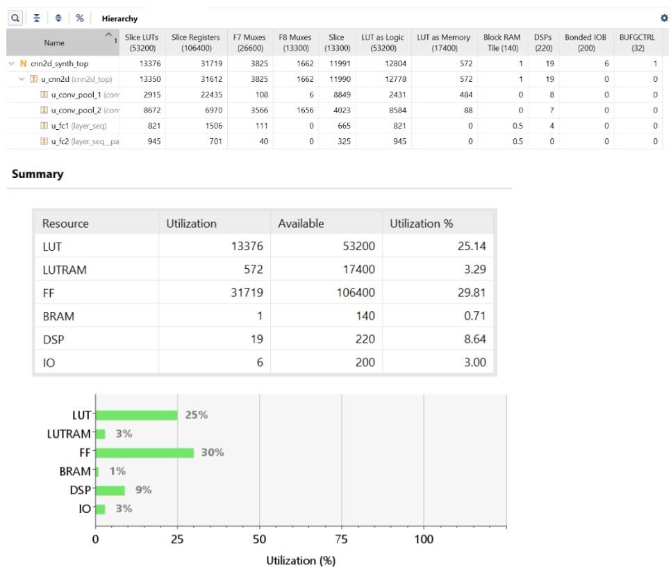
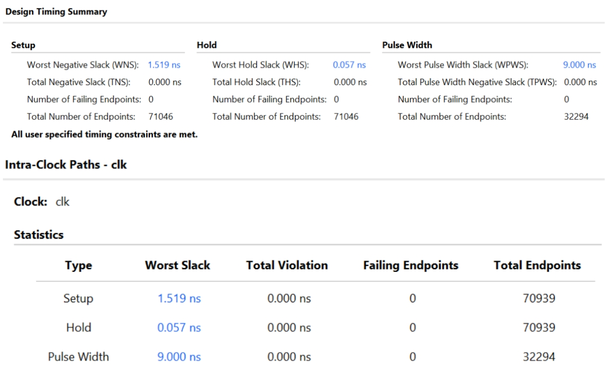
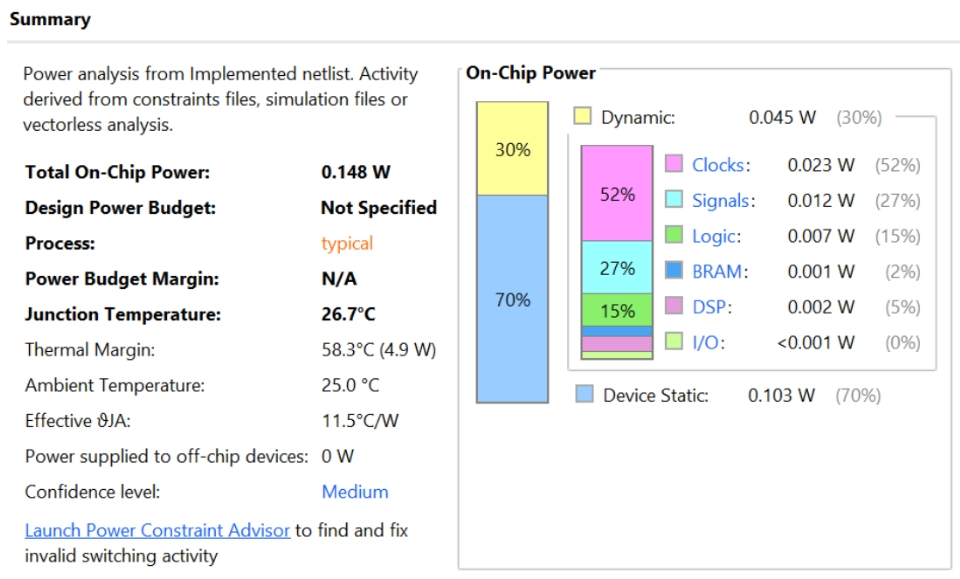

# CNN 2D — Ternary Quantized MNIST Inference on FPGA

**Target device:** Xilinx Zynq-7020 (XC7Z020) &nbsp;|&nbsp; **Arithmetic:** Q16.16 fixed-point &nbsp;|&nbsp; **Simulation:** Vivado XSim &nbsp;|&nbsp; **Training:** PyTorch 2.x

---

This directory contains the complete implementation of two ternary weight quantization strategies for a 2D CNN on MNIST — **TWN+BN** (Ternary Weight Network + BatchNorm) and **TTQ+BN** (Trained Ternary Quantization + BatchNorm) — along with a full-precision baseline for comparison.

The project covers the entire flow: **PyTorch training → weight export → RTL implementation → Vivado simulation → synthesis + implementation on Zynq-7020**.

## Network Architecture

All four software models share the same underlying architecture:

```
Input:  28×28×1  (Q16.16 pixels, range [-1, +1])
   │
   ├── Conv1(1→4, 3×3) → [BN1] → ReLU → MaxPool(2×2)    →  13×13×4
   ├── Conv2(4→8, 3×3) → [BN2] → ReLU → MaxPool(2×2)    →   5×5×8
   ├── Flatten(200)
   ├── FC1(200→32)     → [BN3] → ReLU                    →  32
   └── FC2(32→10)      → logits (argmax → predicted digit)
```

> `[BN]` layers are present in all models except the original baseline CNN2D.

---

## Software Model Comparison

| Model | Test Accuracy | Δ from Original | Weight Precision | Weight Memory | Multipliers/tap | HW Verified |
|-------|:---:|:---:|:---:|:---:|:---:|:---:|
| **CNN2D (Original)** | 98.35% | — | float32 | 28,176 B | 1 (full) | ✓ |
| **CNN2D + BN** | **98.87%** | +0.52% | float32 | 28,176 B | 1 (full) | — |
| **TWN + BN** | 95.85% | −2.50% | 2-bit {−1,0,+1} | 1,761 B | **0** | ✓ |
| **TTQ + BN** ★ | **97.28%** | −1.07% | 2-bit + Wp/Wn | 1,793 B | **0** | ✓ |

> ★ **TTQ+BN is the recommended approach** — only 1.07% accuracy loss for 15.7× weight compression and zero per-tap multipliers.

For a detailed breakdown (per-digit accuracy, sparsity, scaling factors), see [`software/model_comparison_report.md`](software/model_comparison_report.md).

---

## Directory Structure

```
cnn_2d_new/
│
├── hardware_ttq/                      TTQ+BN SystemVerilog RTL
│   ├── cnn2d_top_ttq.sv                 Top-level: layer chaining + flatten/pad
│   ├── conv_pool_2d_ttq.sv              Fused Conv2D + MaxPool2D (9-state FSM)
│   ├── layer_seq_ttq.sv                 Sequential FC layer (8-state FSM)
│   ├── cnn2d_synth_top_ttq.sv           Synthesis wrapper (weights as ROM)
│   ├── tb_cnn2d_ttq.sv                  Testbench (loads .mem, auto-checks)
│   ├── conv2d.sv                        2D convolution (shared)
│   ├── maxpool2d.sv                     2D max pooling (shared)
│   └── multiplier.sv                    Q16.16 multiplier (shared)
│
├── images_ttq/                        TTQ+BN synthesis results
│   ├── utilization1.jpeg                 Resource utilization
│   ├── timing1.jpeg                      Timing summary
│   └── power1.jpeg                       Power estimate
│
├── images_twn/                        TWN+BN synthesis results
│   ├── utilization.jpeg                  Resource utilization
│   ├── timing.jpeg                       Timing summary
│   └── power.jpeg                        Power estimate
│
├── software/                          PyTorch models and comparison
│   ├── cnn2d_bn_model.py                Full-precision + BN baseline
│   ├── cnn2d_twn_bn_model.py            TWN+BN training + weight export
│   ├── cnn2d_ttq_bn_model.py            TTQ+BN training + weight export
│   ├── cnn2d_twn_bn_test.py             TWN+BN test/evaluation
│   ├── cnn2d_ttq_bn_test.py             TTQ+BN test/evaluation
│   ├── export_weights_only.py           Re-export .mem files from saved .pth
│   ├── model_comparison_report.md       Detailed 4-model comparison
│   ├── cnn2d_bn_mnist_model.pth         Saved BN model weights
│   ├── cnn2d_twn_bn_mnist_model.pth     Saved TWN+BN model weights
│   └── cnn2d_ttq_bn_mnist_model.pth     Saved TTQ+BN model weights
│
├── weights/                           TWN+BN .mem files for simulation
│   ├── conv1_ternary_codes.mem          Conv1 ternary codes (2-bit)
│   ├── conv1_b.mem                      Conv1 biases (Q16.16)
│   ├── conv1_bn_scale.mem               Conv1 BN scale (Q16.16)
│   ├── conv1_bn_shift.mem               Conv1 BN shift (Q16.16)
│   ├── conv2_*.mem                      Conv2 parameters
│   ├── fc1_*.mem                        FC1 parameters
│   ├── fc2_*.mem                        FC2 parameters
│   ├── data_in.mem                      Test input (784 pixels, Q16.16)
│   └── expected_label.mem               Expected label (7)
│
├── weights_ttq/                       TTQ+BN .mem files for simulation
│   ├── conv1_wp.mem / conv1_wn.mem      Conv1 Wp/Wn scaling factors
│   ├── conv1_ternary_codes.mem          Conv1 ternary codes
│   ├── conv1_b.mem                      Conv1 biases
│   ├── conv1_bn_scale.mem               Conv1 BN scale
│   ├── conv1_bn_shift.mem               Conv1 BN shift
│   ├── conv2_*.mem, fc1_*.mem, fc2_*.mem
│   ├── data_in.mem                      Test input (digit 7)
│   └── expected_label.mem               Expected label (7)
│
└── ttq_bn_hardware_explanation.html   Interactive HTML hardware walkthrough
```

---

## Hardware Architecture (TTQ+BN)

### RTL Module Hierarchy

```
cnn2d_top_ttq
  ├── conv_pool_2d_ttq  (Conv1+Pool1)   rstn = global reset
  ├── conv_pool_2d_ttq  (Conv2+Pool2)   rstn = pool1_done
  ├── [flatten + zero-pad]               200 values → 240
  ├── layer_seq_ttq     (FC1)            rstn = pool2_done, HAS_BN=1
  ├── [zero-pad]                         32 values → 72
  └── layer_seq_ttq     (FC2)            rstn = fc1_done,  HAS_BN=0
```

Layers are chained through **done signals** — each layer's `done` output is wired to the next layer's `rstn` input. This creates a purely sequential inference pipeline with zero overlap.

### The TTQ Split-Accumulator MAC

The key innovation in TTQ hardware is the **split accumulator**. Instead of multiplying each weight by the activation (which needs a DSP48 per tap), the MAC is decomposed:

```
For each tap in the kernel:
    if ternary_code == +1:   pos_acc += activation    ← no multiply!
    if ternary_code == -1:   neg_acc += activation    ← no multiply!
    if ternary_code ==  0:   skip                     ← free sparsity!

// ONCE per output position (not per tap!):
result = Wp × pos_acc − Wn × neg_acc + bias           ← 2 multiplies total
```

This reduces the number of DSP48 multipliers from **1 per tap** (9–36 per position) to **2 per output position** — a massive reduction on the resource-constrained Zynq-7020 (220 DSP48 slices).

### Conv+Pool FSM (conv_pool_2d_ttq.sv)

9-state FSM that fuses convolution, TTQ scaling, BatchNorm, ReLU, and max-pooling:

```
S_IDLE → S_CONV_COMPUTE → S_CONV_DRAIN → S_CONV_SCALE → S_CONV_BN
                                                           ↓
       ↰ (next position) ← S_CONV_STORE ←─────────────────┘
       │
       ↓ (all positions done)
   S_POOL_COMPARE → S_POOL_STORE → S_DONE
       ↰ (next pool pos)     ↰ (next filter → S_CONV_COMPUTE)
```

| State | Cycles | Operation |
|-------|--------|-----------|
| **S_IDLE** | 1 | Reset all counters, zero accumulators |
| **S_CONV_COMPUTE** | TAP_COUNT | Split accumulation: +1→pos_acc, -1→neg_acc |
| **S_CONV_DRAIN** | 2 | Flush 1-stage pipeline, collect last tap |
| **S_CONV_SCALE** | 1 | `biased_reg = Wp×pos_acc − Wn×neg_acc + bias` (2 DSP48) |
| **S_CONV_BN** | 1 | `bn_product = bn_scale × biased_q16 >>> 16` (1 DSP48) |
| **S_CONV_STORE** | 1 | `bn_result + bn_shift → ReLU → conv_buf` |
| **S_POOL_COMPARE** | 4 | Compare 2×2 window, track maximum |
| **S_POOL_STORE** | 1 | Write max to output array |
| **S_DONE** | holds | Assert `done` to release next layer |

### FC Layer FSM (layer_seq_ttq.sv)

8-state FSM for sequential fully-connected layers:

```
S_IDLE → S_FILL → S_MAC → S_DRAIN → S_SCALE → [S_BN] → S_STORE → S_DONE
                    ↰ (all inputs)                          ↰ (next neuron → S_FILL)
```

| State | Cycles | Operation |
|-------|--------|-----------|
| **S_IDLE** | 1 | Reset counters |
| **S_FILL** | 1 | Prime pipeline (load first weight code + input) |
| **S_MAC** | WIDTH | Same split accumulation as Conv |
| **S_DRAIN** | 2 | Pipeline flush |
| **S_SCALE** | 1 | `biased_reg = Wp×pos_acc − Wn×neg_acc + bias` |
| **S_BN** | 1 | BN multiply (FC1 only, skipped for FC2) |
| **S_STORE** | 1 | ReLU (FC1) or raw logit (FC2) → output |
| **S_DONE** | holds | Assert `counter_donestatus` |

### Cycle Count Summary

| Layer | Positions/Neurons | Taps | Cycles/pos | Pool | Total Cycles | Time @100MHz |
|-------|:-:|:-:|:-:|:-:|:-:|:-:|
| Conv1+Pool1 | 676 (26×26) × 4 filters | 9 | 14 | 169×5 | ~41,236 | ~0.41 ms |
| Conv2+Pool2 | 121 (11×11) × 8 filters | 36 | 41 | 25×5 | ~40,688 | ~0.41 ms |
| FC1 | 32 | 240 | 245 | — | 7,840 | ~0.08 ms |
| FC2 | 10 | 72 | 76 | — | 760 | ~0.008 ms |
| **Total** | | | | | **~90,524** | **~0.91 ms** |

---

## TTQ+BN Synthesis Results

### Resource Utilization


### Timing Summary


### Power Estimate


---

## TWN+BN Synthesis Results

### Resource Utilization



### Timing Summary



### Power Estimate



---

## Simulation Results

### TTQ+BN Simulation — PASS ✓

```
============================================================
  TTQ+BN 2D CNN INFERENCE COMPLETE - RESULTS
============================================================

  Output[0] (digit 0) = -307310       Output[5] (digit 5) = -627477
  Output[1] (digit 1) = -330903       Output[6] (digit 6) = -769586
  Output[2] (digit 2) = -193366       Output[7] (digit 7) =  707004  ← MAX
  Output[3] (digit 3) =   11879       Output[8] (digit 8) = -416308
  Output[4] (digit 4) = -533209       Output[9] (digit 9) =   29030

  >>> DETECTED DIGIT: 7 <<<
  >>> Confidence (raw logit): 707004 <<<
  --- EXPECTED DIGIT: 7 ---
  *** RESULT: PASS - Prediction matches expected label! ***
```

Hardware logits match software Q16.16 reference to within **<0.01% error** (max error: 72 LSBs out of 769K).

| Digit | Software Q16.16 | Hardware | Error (LSBs) |
|:-----:|:---:|:---:|:---:|
| 0 | -307,357 | -307,310 | 47 |
| 1 | -330,905 | -330,903 | 2 |
| 2 | -193,373 | -193,366 | 7 |
| 3 | 11,852 | 11,879 | 27 |
| 4 | -533,191 | -533,209 | 18 |
| 5 | -627,465 | -627,477 | 12 |
| 6 | -769,538 | -769,586 | 48 |
| **7** | **706,963** | **707,004** | **41** |
| 8 | -416,236 | -416,308 | 72 |
| 9 | 29,094 | 29,030 | 64 |

---

## Quick Start

### Simulation (Vivado XSim)

1. **Create Vivado Project** → RTL Project → device `xc7z020clg484-1`
2. **Add Sources** → add all `.sv` files from `hardware_ttq/`
3. **Set Simulation Top** → `tb_cnn2d_ttq`
4. **Copy .mem files** from `weights_ttq/` to the simulation working directory:
   ```
   <project>/<project>.sim/sim_1/behav/xsim/
   ```
5. Run simulation:
   ```tcl
   run 100ms
   ```

### Synthesis

1. Same project, set synthesis top → `cnn2d_synth_top_ttq`
2. Run Synthesis → Run Implementation → open reports

### Re-train and Re-export Weights

```bash
cd software/

# Train TTQ+BN (15 epochs, warm-starts from TWN if available)
python3 cnn2d_ttq_bn_model.py

# Train TWN+BN
python3 cnn2d_twn_bn_model.py

# Train BN-only baseline
python3 cnn2d_bn_model.py

# Re-export .mem files from saved .pth (without retraining)
python3 export_weights_only.py
```

---

## Fixed-Point Format: Q16.16

All values in the hardware (pixels, weights, biases, BN parameters, logits) use **Q16.16 signed fixed-point**:

```
Bit 31              Bit 16  Bit 15              Bit 0
 [S][INTEGER BITS (15)]  .  [FRACTIONAL BITS (16)]

Range:  -32768.0 to +32767.99998 (≈ ±32K)
Resolution: 1/65536 ≈ 0.0000153

Multiply: (A × B) >>> 16 → result in Q16.16
Hex example: 0xFFFF0000 = -1.0,  0x00010000 = +1.0
```

The ternary weights are stored as **2-bit codes**: `2'b01 = +1`, `2'b11 = -1`, `2'b00 = 0`. The Wp/Wn scaling factors and all biases/BN parameters are stored as full 32-bit Q16.16 values.

---

## Key Design Decisions

**Split MAC eliminates per-tap multipliers** — By accumulating positive-coded and negative-coded activations separately, the only multiplications are `Wp × pos_acc` and `Wn × neg_acc`, which fire once per output position (not per tap). For Conv1 with 9 taps, this is a 4.5× reduction in DSP usage.

**Layer chaining via done/rstn** — Rather than a global controller, each layer's done signal releases the next layer from reset. This self-sequencing approach requires zero additional control logic and naturally handles variable-latency layers.

**BN folding at export time** — The Python export script pre-computes `scale = γ/√(σ²+ε)` and `shift = β − μ×scale`, converting the 4-parameter BN operation into a single `scale × x + shift` at inference time. This halves the BN compute and eliminates the need for mean/variance storage.

**Zero-padding for FC weight ROM** — Each FC neuron's weight vector is padded with 20 zeros on each side. This simplifies the BRAM addressing logic (same `w_addr` counter for all neurons) at a small memory cost (40 × 10 neurons × 2 bits = 100 bytes).

---

## Interactive Hardware Walkthrough

For a full interactive explanation with clickable FSM diagrams and a cycle-by-cycle worked example, open:

📄 **[`ttq_bn_hardware_explanation.html`](ttq_bn_hardware_explanation.html)** — open in any browser.

---

## Tech Stack

| Layer | Tools / Version |
|-------|-----------------|
| Hardware description | SystemVerilog (IEEE 1800-2012) |
| Simulation | Xilinx Vivado XSim |
| Synthesis / P&R | Xilinx Vivado 2023+ |
| Target FPGA | xc7z020clg484-1 (Zynq-7020) |
| Deep learning | PyTorch 2.x |
| Arithmetic | Q16.16 fixed-point (32-bit signed) |
| Python | 3.10+ |
